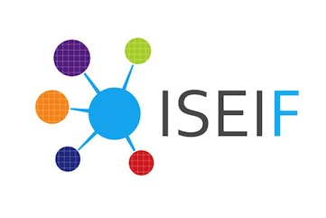

DSSG Energy Disaggregation
==========================

Contents
-------------
This repository contains a set of tools for performing end-to-end
disaggregation of single-point energy signals at a low-resolution timescale of
15 - 30 minutes, including algorithms for supervised and unsupervised
decomposition of signals into component appliance-level signals.

In particular, the repository contains:

- the `disaggregator` module, a package of tools for an assortment of
  disaggregation tasks
- `proto`, a directory of ipython notebooks and scripts organized by topic.
- `tests`, a directory containing unit tests for the `disaggregator` module.
- `docs`, a directory containing documentation including sphinx autogen
  directives and instructions for contributors.

How to use the disaggregator module
-----------------------------------

***Please view documentation at /docs/sphinx/html/index.html***

Documentation can be found in the
[docs](https://github.com/dssg/wikienergy/tree/master/docs) directory.

Installation
------------

Because the `disaggregator` package is in early stages of rapid development,
it is neither in PyPI, nor installable via `setup.py`. To use the module,
simply clone the repo and add it to your path as follows:

    import sys
    import os.path
    sys.path.append(os.path.join('path/to/repository', 'wikienergy'))

Tutorials
---------

Tutorials can be found [here](https://github.com/dssg/wikienergy/tree/master/docs/tutorials)

Proto
-----

The [proto](https://github.com/dssg/wikienergy/tree/master/proto)
directory contains a set of ipython notebooks with (less organized) analysis
in greater depth.

Tests
-----

To run the test suite, please refer to the
[developer guide]("https://github.com/dssg/wikienergy/tree/master/docs/dev").

Partners
-------

Team members
------------

[Phil Ngo](http://www.philngo.me/) | [Miguel Perez](https://www.linkedin.com/profile/view?id=337090498) | [Stephen Suffian](https://www.linkedin.com/profile/view?id=56235598) | [Sabina Tomkins](https://www.linkedin.com/profile/view?id=280366604) | Matthew Gee | Varun Chandola

Alternatives
------------

For a set of tools designed for evaluating and measuring
the effectiveness of new algorithms, please instead use
[nilmtk](https://github.com/nilmtk/nilmtk/) (Non-Intrusive Load
Monitoring Toolkit), which is designed with the needs of researchers in mind.

