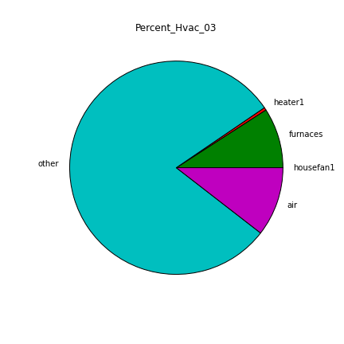
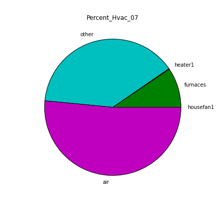
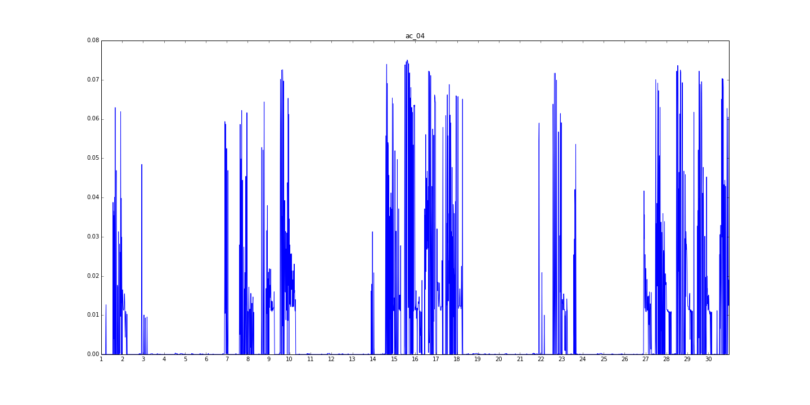
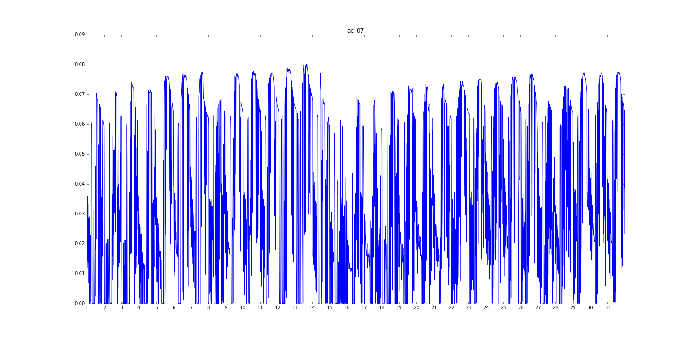
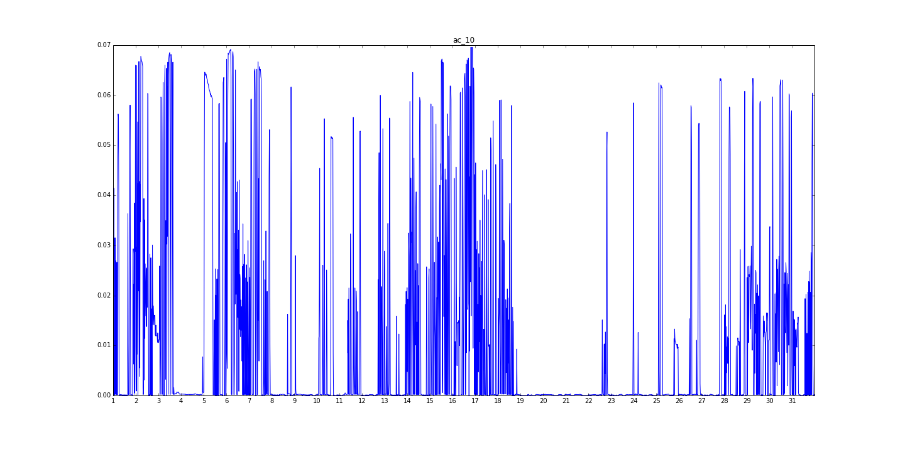
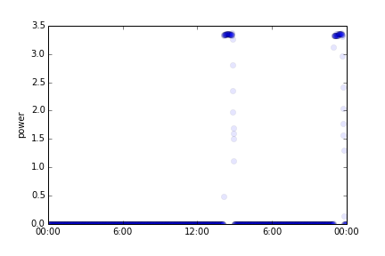

#Wikienergy Deep Dive 1
_____________________________
##Outline
- Goals
  - tool for evaluating energy-saving interventions
  - accurate energy disaggregator (15 minutes)
- Data Sources
  - Pecan Street
  - Tracebase
  - Weather
  - [Oak Park]
- Algorithms
  - FHMM
  - Neural Networks
- Analysis
  - Most Common Appliances
  - Weather vs. Energy Usage
  - % HVAC
  - EV Analytics

 _____________________________

##Data Sources

###Pecan Street

####Overview
- 23 cities
- disaggregated ground truth
- ~70 unique appliances
  - 8-20 typical per house
- professional audit and survey data
  - city
  - type of insulation
  - type of HVAC
  
####Curated Dataset
- Austin, TX
- 75 households
- January-November 2013
- 15 minute intervals

####Raw Dataset
- 577 households
- 15 minute and 1 minute

####Shared Dataset
- 200 households
- January-April 2014
- 1 minute intervals

###Tracebase
- 24-hour, 1-second data for 43 unique appliances
- up to 200 traces per appliance
- from TU Darmstadt, Germany

###Weather
- historical and live hourly interval weather data
- source: wunderground

###Oak Park
- 15 minute (possibly 1 minute)
- green button API
- LIVE!!

_____________________________
 
##Goals

###Disaggregation

- Existence
- Modeling Appliances
- Labeling States
- Extracting Signal

 _____________________________
 
##Algorithms

###Hidden Markov Model (HMM)

-  Develop appliance instance parameters using hidden markov models
    *   zt(discrete variable) corresponds to one of K states (state1=on, state2=off)
    *   xt (continous variable) is amount of power > 0 (e.x. 100 W)
    *   Hidden Markov Parameters:
        *   Initial Probabilities (&alpha;)
        *   Transition matrix (C) (probability of transition between hidden states)
        *   Emission variables (&phi;) – Gaussian-Gamma, hyperparameters: 
            *   mean, precision, shape, scale
        *   Observed Data (power values, other features)
        *   Hidden States (ON or OFF)
    *  Can be used to generate sample data, predict states, evaluate likelihood
    *  Often used for modeling probabalistic temporal processes
    *  Limited ability to model periodic signals
    *  

###Factorial Hidden Markov Model (FHMM)
*  combines several hidden markov models in parallel
*   state space comprises all possible combinations of appliance states

###Neural Networks
* Used for semi-supervised and supervised learning
* Good for modeling non-linear functions
* Mimics biological neurons
* Multiple layers of neurons
* Each neuron applies a sigmoidal function to the weighted sum of the activations of its input neurons

###Accomplishments
* Made HMM appliance models using Tracebase data
* Made training data for FHMMs using appliance models
* Disaggregated Tracebase test data
* Used HMM models to train a neural network
 
###Challenges
* Detecting appliance existence 
* Encoding time in FHMMs
* Understand Step Variant Convolutional Neural Networks

________________________

##Analysis 
###Most Common Appliances in Homes
* Ask for suggestions

###Percent HVAC 
*Historically Heating Ventilation and Air Conditioning have consumed over half of all home energy. Nationwide the fraction of energy consumed by HVAC has gone done from 58% in 1993 to 48% in 2009, but the number is still large. In intense climates the percent used by HVAC can be even larger, in research done by Pecan Street HVAC demanded 82% of the energy of some homes. Here is what we found:

 

###Weather
* Sanity check for Heat and AC use, by looking at correlation
* Created an API which returns minute interval weather data(temp) by zip code
    * This allows us to embed weather information in future models 

####Usage
Use `get_weather_data(api_key,city,state,start_date,end_date)` to query historical weather data. The function will return a JSON object. To query live weather data, use `get_current_temp(city,state, zipcode = None)`.
####January Temperature

####January AC Usage

####April Temperature

####April AC Usage

####July Temperature

####July AC Usage

####October Temperature

####October AC Usage

###EV
After speaking with Pecan Street we learned that there is need for a way to reliably classify an electric vehicle opposed to another large load, such as HVAC. We've started exploring the homes with EV data looking for the signatures of these cars. 

