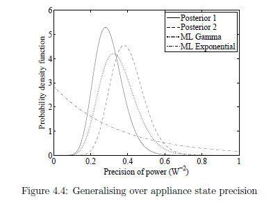
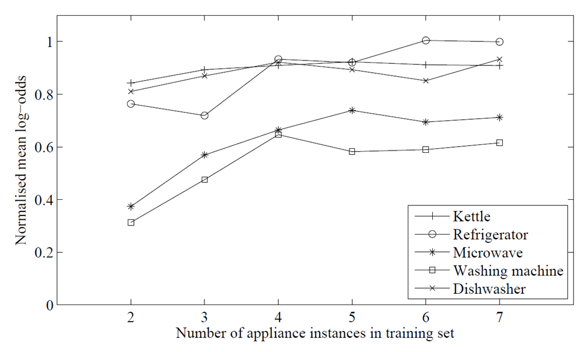
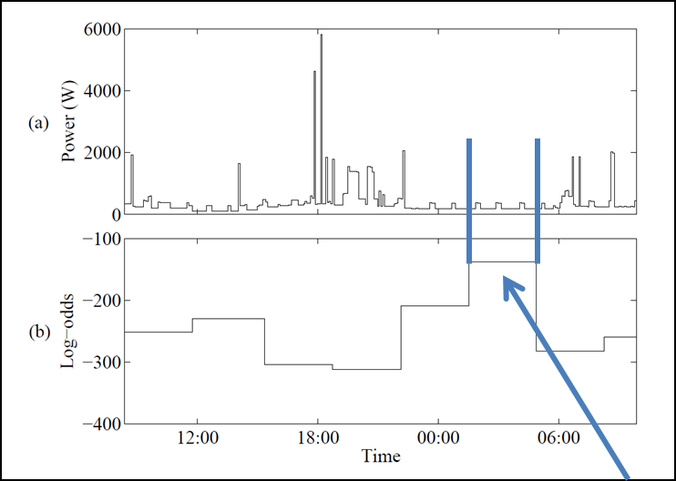
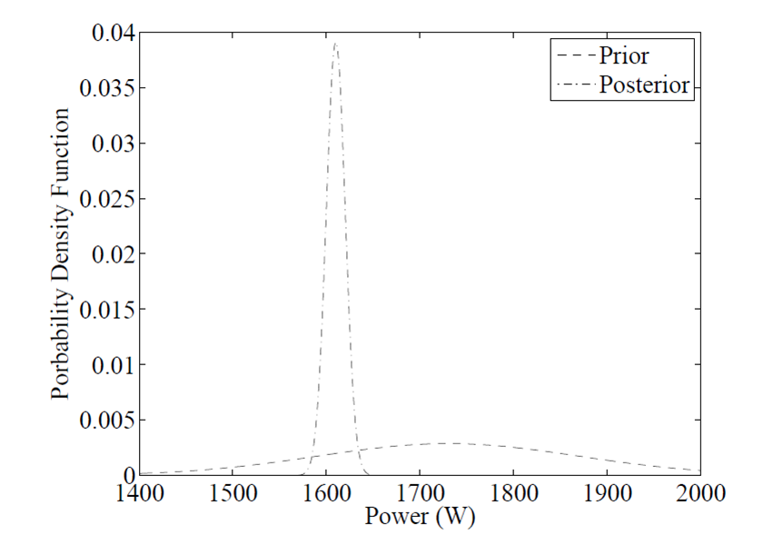
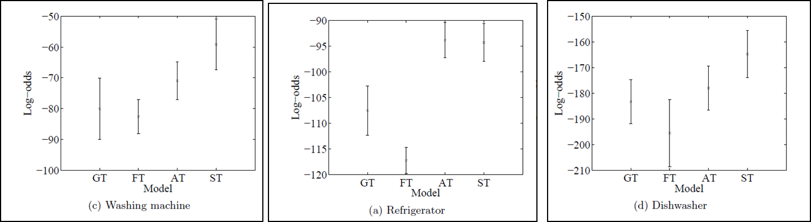

Wikienergy
==========

#Parson's Method for Energy Disaggreation
_______

##Creating models for appliances

###Converting Appliance Instance Power Data to an appliance instance model:
1.  Develop appliance instance parameters using hidden markov models
    *   zt(discrete variable) corresponds to one of K states (state1=on, state2=off)
    *   xt (continous variable) is amount of power > 0 (e.x. 100 W)
    *   Priors for hidden markov:
        *   Initial Probabilities (&alpha;): dirichlet distribution (K categories, uniform concentration)
        *   Transition matrix (C)– each row: dirichlet distribution (K categories, uniform conc.)
        *   Emission variables (&phi;) – Gaussian-Gamma, hyperparameters: 
            *   &lambda;t corresponds to initial mean (&lambda;off=0 W, &lambda;on=100 W)
            *   rt corresponds to initial precision (roff=large, ron=small)
            *   Bt corresponds to initial shape (broad distribution)
            *   wt corresponds to initial scale (broad distribution)
2.  Run HMM, use variational message passing to perform inference with convergence

###Combining appliance instance models to a single appliance type model:
1.  Sample posterior distributions and fit them to dirichlet/gaussian/gamma
    *   For initial probabilities(&alpha;) and transition matrix (C), fit samples to dirichlet
    *   For emission mean parameters (&lambda;, r), fit samples to gaussian
    *   For emission precision variables (B,w), fit samples to gamma
        *   Off states are constrained to exponential distributions
            *   Power samples captured during state transitions wouldn’t be captured by overfit, tight distributions

            *   Accomplished by fixing shape (B) to 1 for ‘off’ state (k=1) when calculating gamma distribution
            *  Bt corresponds to initial shape (broad distribution)
            *  wt corresponds to initial scale (broad distribution)
2.  For each parameter, take argmax to get single distribution and obtain overall model

###Using previously described model formulation on tracebase data:
1.  Data Description
    *   Appliances:
        *   2-State: refrigerator, kettle, microwave
        *   3-state: washing machine, dishwasher
    *   8 instances for each appliance set
        *   Hold-one out (7 for learning, 1 for testing)
        *   Modelling done over varying ordered lists of 7 instances (50 folds)
        *   Normalized mean-log odds of different appliances
2.  Comparison of models using varying learning set sizes
    *   Normalized chart:
            *   0 is model using single instance that is not test instance
            *   1 is model using single instance that is also test instance

##Applying model to aggregated data set

###Recognizing appliances in data

*   When searching for a specific appliance in a trace of aggregated data:
    1.  Search across aggregated data in set windows
        *   Window length determined by maximum appliance instance signature len
            *   (this works for fridges, we may have to mess with window lengths for appliances only on during busier times) 
    2.  In each data window, subtract base loads across data windows
    3.  Calculate likelihood that remaining load generated from that appliance
        *   If probability that data window matches appliance model is above threshold D, then assume that only that appliance is on
        *   D is calculated using tracebase data:
            *   For each tracebase appliance instance i, xi probability that instance matches model, D=min(x)
            *   2AM-5AM, high probability that only fridge is on

###Tuning model with recognized appliance
*   Bayesian integration used to integrate recognized signature with existing model
        *   Helpful for narrowing certain parameters (such as mean distribution):
            *ex) microwave mean power &mu;k

###Evaluation of model tuning (tested with REDD)
1.   Adjust REDD to fit tracebase:
     *   Manually change mean  power distribution for microwave and washing machine due to difference in US and EU appliances
2.   Compare four approaches of model tuning
     1.  GT: no tuning (worst)
     2.  FT: unsupervised learning with FHMM and general appliance priors (state-of-art)
     3.  AT: single appliance recognition and bayesian integration (described method)
     4.  ST: tuned with sub-metered data from REDD (ideal)
*    Conclusion: FHMM doesn’t work, Parson’s method seems pretty good

