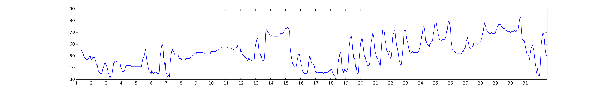
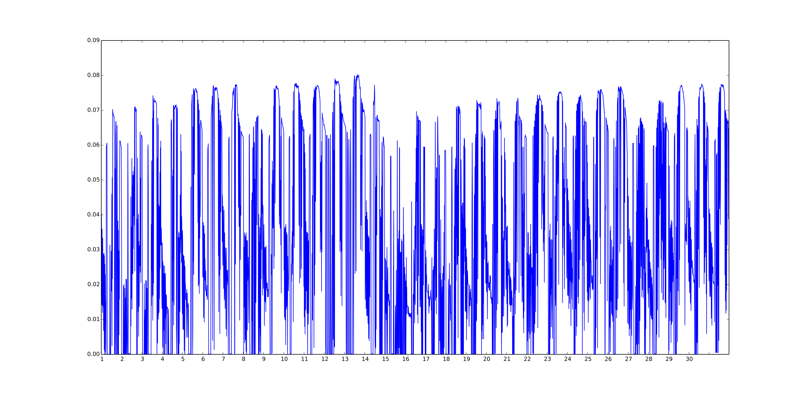
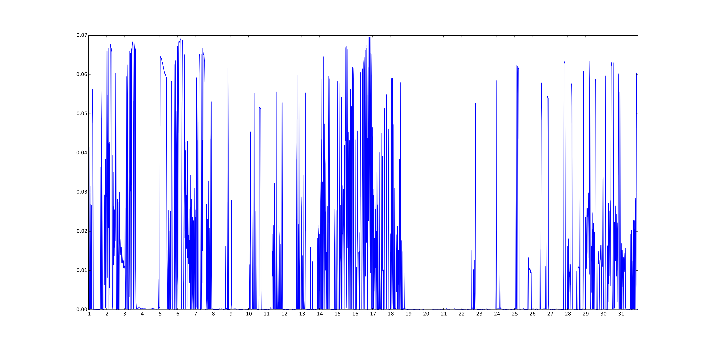

Weather and Linear Regression
=============================

- linregress-evaluate: This notebook takes pecan street data and evaluates the linear regression method. 

- linregress-oakpark: This notebook takes oak park data and uses the linear regression method. 

- solar\_estimator: This notebook uses NREL data to estimate solar output for a given month.

- weather\_normalized\_regression-Pecan-validated: This is an older notebook that uses Pecan Street data to explore the use of linear regression.

-weather\_normalized\_regression: This is the original notebook that was actually using california data to calculate a linear regression.

#Temperature vs Energy Use
_______
This directory has a stable function to query weather data using the [weatherunderground](http://www.wunderground.com/) API.
There is also example notebooks that run regressions of temperature with energy.
##January
Temperature:

Energy:

##April
Temperature:

Energy:

##July
Temperature:

Energy:

##October
Temperature:

Energy:

